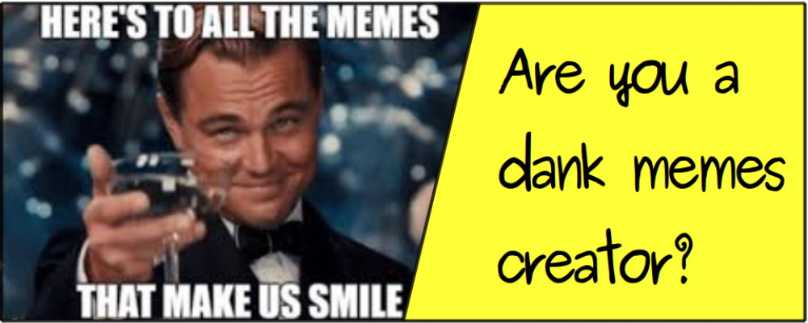
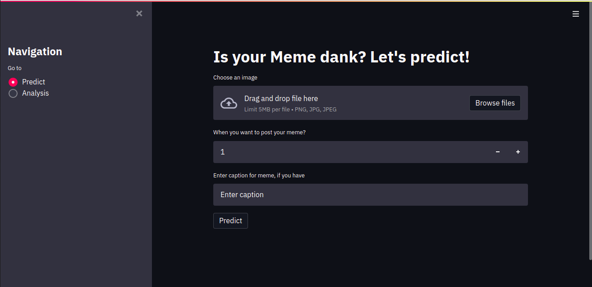
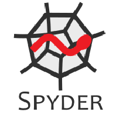

# Meme - Dank or Not?

## Introduction and Overview

Memes, the word itself puts a smile on our face, when we see a meme at first glance our mind thinks, “oh! it is going to be something interesting” wether or not that meme is going to make us laugh or smile or even nothing. 0ver the past decade, memes has became very popular in many areas such as computer science, marketing, health care, sociology, technology etc and day by day as people are spending more time over internet, it’s popularity is increasing, it’s all because it passes informations with a pinch of humor even a serious one. Now a days social media sites such as Reddit, Facebook, Instagram, Twitter are flodded with memes, even government officers and organizations are trying to convay messages to public using memes, isn’t that interesting. During all this, some of the memes becomes viral and there should be a reason for becoming a meme viral.

## Dataset

For this project I have collected data from many subreddits (meme, memes, 4PanelCringe, teenagers, dankmemes, PrequelMemes, HistoryMemes, MemePiece, funny, MadeOfStyrofoam) of Reddit between 1st November 2020 to 20th November 2020, from largest meme subreddit to lowest one in terms of subscribers, so that we get memes of every flavours. For this project I have used memes in the form of images (no gif and no video) and data available for the post of the meme such as time of post, number of upvotes, size of image etc. 
To collect the data I have used Pushshift API provided by Reddit and in python PSAW: Python Pushshift.io API Wrapper is a wrapper for searching public reddit comments/submissions via the pushshift.io API.

Data sets can be found - https://github.com/NIKsaurabh/Meme-Dank-or-Not-/tree/main/data and https://drive.google.com/drive/folders/1q_hqilR1E59LY2pA0TxjFL4dh53YhXLJ?usp=sharing

Downloaded image data can be found here - https://drive.google.com/drive/folders/1a0u6Z33r49gsrkIr9n-CZUgs30L-Uqjx?usp=sharing

## The Challenge

* Since memes are in the form of images and these images contains many data such as text in the image, objects in the image, HSV (Hue Saturation and Value) of image and colors in the images. So, I have extracted these data from all of the images, how to do that, I will discuss later in this blog.
* After all the data collection part, I have three types of data:
    1. Categorical and numerical based data
    2. Text based data
    3. Image based data
and for all these three types of data I have created three different machine learning and deep learning models.

# Project life-cycle

* Meme data Collection
    * Tabualar data
    * Image data
    * Data from imageas as well
* Data cleaning
* Done Exploratory Data Analysis (EDA)
* Feature Engineering
  * Encoded categorical features
  * Encoded datetime features
  * Encoded text feature
  * Created 3 different datasets
* Model creation
    1. Model for Categorical and numerical based data
    2. Model for text based data
    3. Model for image data
* Web-app creation 

## Algorithms and Models used
  * **To get sentiment of text**
      * Pre-trained LSTM
  * **To Extract text from images**
      * OpenCV
      * OCR
  * **To extract HSV of image**
      * OpenCV
  * **To extract colors of image**
      * OpenCV
  * **To extract objects and it's probability of occurance**
      * VGG16
  * **Feature selection**
      * Random Forest
      * Gradient Boost
  * **Machine Learning model**
      * Random Forest classifier
      * Gradient Boosting classifier
      * Balanced Bagging Classifier 
      **Balanced Bagging Classifier performed better**
  * **CNN model**
      * VGG16 with transfer learning
      * InceptionV3 with transfer learning
      * EfficientNetB5 with transfer learning
      * ResNet50 with transfer learning 
      **ResNet50 performed better**
  * **NLP model**
      * BERT

## Libraries used
* pandas
* numpy
* datetime
* request
* matplotlib
* seaborn
* psaw (PushshiftAPI)
* multiprocessing
* json
* nltk
* **tensorflow**
* **keras**
* **pytesseract**
* **cv2**
* skimage
* re (regular expression)
* **keras**
* pytz
* prettytable
* **sklearn**
* wordcloud
* imblearn
* pickle
* **tensorflow_hub**
* **tensorflow_text**

## Web-app
Created web app using **Streamlit**

## Web-app image

## Language used

## IDE used

## Blog
For detailed information visit here: https://niksaurabh.medium.com/meme-dank-or-not-cec4895adfb2

